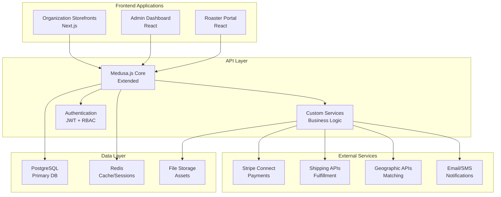
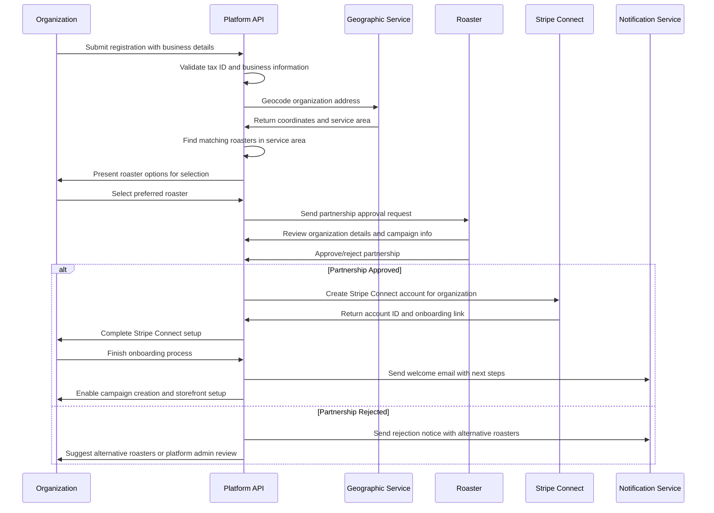
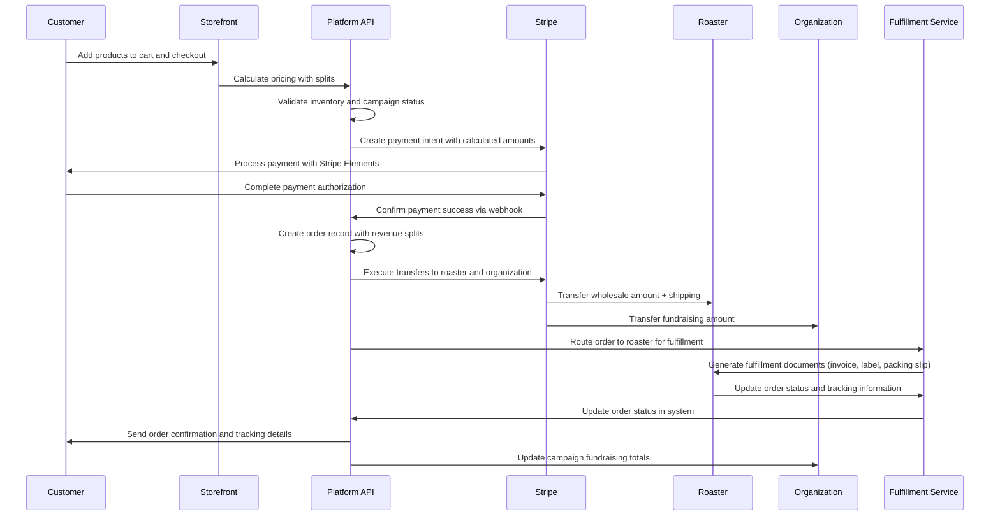

# Coffee Fundraising Platform - Fullstack Architecture Document

## Introduction

This document outlines the complete fullstack architecture for the Coffee Fundraising Platform, including backend systems, frontend implementation, and their integration. It serves as the single source of truth for AI-driven development, ensuring consistency across the entire technology stack.

The architecture supports a multi-tenant marketplace where organizations run multiple fundraising campaigns through branded coffee storefronts, with coffee roasters handling fulfillment and automated revenue splitting via Stripe Connect.

### Starter Template Decision
**Decision**: Custom Medusa.js implementation with Next.js frontend
**Rationale**: Medusa.js provides robust e-commerce foundation with multi-tenant capabilities, while Next.js enables dynamic storefront generation. No existing starter template matches our specific multi-tenant fundraising requirements.

### Change Log
| Date | Version | Description | Author |
|------|---------|-------------|---------|
| 2024-01-XX | 1.0 | Initial architecture document | System Architect |

## High Level Architecture

### Technical Summary
The system employs a microservices-oriented architecture built on Medusa.js with custom multi-tenant extensions. The platform uses a hub-and-spoke model where organizations create branded storefronts, roasters manage fulfillment, and the platform orchestrates payments through Stripe Connect. Key architectural patterns include multi-tenant data isolation, event-driven workflows for approvals and fulfillment, and automated revenue splitting with comprehensive audit trails.

### High Level Overview
The platform consists of three main application layers:
1. **Organization Storefronts**: Dynamic Next.js applications with custom branding
2. **Admin Dashboards**: React-based management interfaces for all user types
3. **API Layer**: Extended Medusa.js backend with custom business logic

The system integrates with Stripe Connect for payments, shipping APIs for fulfillment, and geographic services for roaster-organization matching. All data is stored in PostgreSQL with Redis caching for performance.

### Repository Structure
**Structure**: Monorepo with Nx workspace
**Monorepo Tool**: Nx for build optimization and dependency management
**Package Organization**: Apps (storefronts, admin, api) and shared libraries (ui-components, business-logic, types)

### High Level Architecture Diagram


## Tech Stack

### Backend Technologies
- **Framework**: Medusa.js v2 with TypeScript and marketplace plugin
- **Runtime**: Node.js 20 LTS with Express.js
- **Database**: Supabase PostgreSQL with multi-tenant isolation
- **Cache**: Redis 7+ (managed) for sessions and performance
- **Authentication**: Stytch with role-based access control across all apps
- **API Style**: REST with GraphQL for complex queries

### Frontend Technologies
- **Organization Storefronts**: Next.js 14+ with App Router
- **Admin Interfaces**: React 18+ with Vite build system
- **UI Framework**: Tailwind CSS with Headless UI components
- **State Management**: Zustand for client state, React Query for server state
- **Forms**: React Hook Form with Zod validation
- **Charts**: Recharts for analytics dashboards

### Infrastructure & DevOps
- **Hosting**: Railway (Medusa API) + Vercel (Next.js apps)
- **Database**: Supabase PostgreSQL with connection pooling
- **Cache**: Managed Redis 7 (Redis Cloud or Railway Redis)
- **CDN**: Vercel Edge Network for global content delivery
- **Monitoring**: Railway metrics + Vercel analytics
- **CI/CD**: GitHub Actions with Nx build optimization

### External Integrations
- **Authentication**: Stytch for auth + RBAC across all apps
- **Payments**: Stripe Connect for multi-party transactions and payouts
- **Shipping**: Individual roaster APIs with platform fallback
- **Geographic**: Location-based roaster-organization matching
- **Email**: SendGrid for transactional emails
- **SMS**: Twilio for urgent notifications

## Data Models

### Organization
**Purpose**: Represents fundraising entities that run multiple campaigns

**Key Attributes**:
- `id`: UUID - Primary identifier
- `name`: String - Organization display name
- `slug`: String - URL-friendly identifier for storefronts
- `tax_id`: String - Tax identification number (encrypted)
- `status`: Enum - active, pending, suspended, inactive
- `roaster_id`: UUID - Associated roaster for fulfillment
- `branding`: JSON - Logo, colors, messaging customization
- `fundraising_settings`: JSON - Default campaign settings
- `created_at`: Timestamp - Registration date

**Relationships**:
- Has many campaigns (one-to-many)
- Belongs to one roaster (many-to-one, after approval)
- Has many orders through campaigns

### Campaign
**Purpose**: Individual fundraising initiatives under an organization

**Key Attributes**:
- `id`: UUID - Primary identifier
- `organization_id`: UUID - Parent organization
- `name`: String - Campaign name (e.g., "Volleyball Team 2024")
- `slug`: String - URL segment for campaign-specific pages
- `goal_type`: Enum - time_based, amount_based, ongoing
- `goal_amount`: Decimal - Target fundraising amount (if amount_based)
- `end_date`: Date - Campaign end date (if time_based)
- `status`: Enum - draft, active, paused, completed, cancelled
- `current_raised`: Decimal - Running total of funds raised
- `storefront_active`: Boolean - Whether storefront accepts orders

**Relationships**:
- Belongs to one organization (many-to-one)
- Has many orders (one-to-many)
- Has campaign-specific branding and messaging

### Roaster
**Purpose**: Coffee providers who fulfill orders and manage product catalogs

**Key Attributes**:
- `id`: UUID - Primary identifier
- `business_name`: String - Legal business name
- `display_name`: String - Public-facing name
- `address`: JSON - Complete business address with coordinates
- `service_radius`: Integer - Service area in miles (null for national)
- `is_national`: Boolean - Can serve any location
- `stripe_connect_id`: String - Stripe Connect account identifier
- `approval_settings`: JSON - Auto-approval criteria and preferences
- `capacity_limit`: Integer - Maximum concurrent partnerships
- `current_partnerships`: Integer - Active organization count
- `status`: Enum - active, pending, suspended, inactive

**Relationships**:
- Has many organizations (one-to-many, after approval)
- Has many products (one-to-many)
- Has many shipping configurations (one-to-many)

### Product
**Purpose**: Coffee products available for sale through organization storefronts

**Key Attributes**:
- `id`: UUID - Primary identifier
- `roaster_id`: UUID - Owning roaster
- `name`: String - Product name
- `description`: Text - Product description
- `retail_price`: Decimal - Customer-facing price
- `wholesale_price`: Decimal - Roaster cost basis
- `weight`: Decimal - Product weight for shipping
- `inventory_tracked`: Boolean - Whether to track inventory
- `current_inventory`: Integer - Available quantity (if tracked)
- `is_active`: Boolean - Available for sale
- `product_images`: JSON - Array of image URLs

**Relationships**:
- Belongs to one roaster (many-to-one)
- Has many order line items (one-to-many)

### Order
**Purpose**: Customer purchases with multi-party payment splitting

**Key Attributes**:
- `id`: UUID - Primary identifier
- `campaign_id`: UUID - Associated campaign
- `customer_id`: UUID - Purchasing customer
- `roaster_id`: UUID - Fulfilling roaster
- `status`: Enum - pending, paid, processing, shipped, delivered, cancelled
- `subtotal`: Decimal - Product total before fees
- `shipping_cost`: Decimal - Shipping charges
- `fundraising_amount`: Decimal - Amount going to organization
- `platform_fee`: Decimal - Platform transaction fee
- `total_amount`: Decimal - Total charged to customer
- `stripe_payment_intent_id`: String - Stripe payment reference
- `tracking_number`: String - Shipment tracking
- `shipped_at`: Timestamp - Fulfillment date

**Relationships**:
- Belongs to one campaign (many-to-one)
- Belongs to one customer (many-to-one)
- Belongs to one roaster (many-to-one)
- Has many line items (one-to-many)

## Components

### Authentication Service
**Primary Responsibility**: User authentication and authorization across all user types
**Key Interfaces**: 
- `/auth/login` - JWT token generation with role claims
- `/auth/refresh` - Token refresh and validation
- `/auth/permissions` - Role-based access control validation
**Dependencies**: User management service, Redis for session storage
**Technology**: JWT with role-based claims, bcrypt for password hashing

### Organization Management Service
**Primary Responsibility**: Organization onboarding, campaign management, and storefront configuration
**Key Interfaces**:
- `/organizations` - CRUD operations for organization data
- `/organizations/{id}/campaigns` - Campaign management
- `/organizations/{id}/storefront` - Branding and customization
**Dependencies**: Roaster service for partnership requests, payment service for Stripe setup
**Technology**: Custom Medusa.js services with PostgreSQL storage

### Roaster Management Service
**Primary Responsibility**: Roaster onboarding, product catalog, and partnership approvals
**Key Interfaces**:
- `/roasters` - Roaster profile and business information
- `/roasters/{id}/products` - Product catalog management
- `/roasters/{id}/partnerships` - Organization approval workflow
**Dependencies**: Geographic service for service area validation, payment service for Connect setup
**Technology**: Extended Medusa.js entities with custom approval workflows

### Payment Processing Service
**Primary Responsibility**: Multi-party payment processing and revenue splitting
**Key Interfaces**:
- `/payments/process` - Order payment with automatic splits
- `/payments/transfers` - Revenue distribution to roasters and organizations
- `/payments/webhooks` - Stripe webhook handling
**Dependencies**: Stripe Connect API, order management service
**Technology**: Stripe Connect with Express accounts, webhook validation

### Geographic Matching Service
**Primary Responsibility**: Location-based roaster-organization matching and service area validation
**Key Interfaces**:
- `/geographic/match` - Find available roasters for organization location
- `/geographic/validate` - Verify service area coverage
- `/geographic/distance` - Calculate distances between locations
**Dependencies**: Google Maps API for geocoding, roaster service for service areas
**Technology**: PostGIS for geographic queries, Google Maps API integration

### Order Fulfillment Service
**Primary Responsibility**: Order processing, document generation, and shipment tracking
**Key Interfaces**:
- `/fulfillment/orders` - Order processing and routing
- `/fulfillment/documents` - Invoice, label, and packing slip generation
- `/fulfillment/tracking` - Shipment status updates
**Dependencies**: Shipping APIs, document generation service, notification service
**Technology**: PDF generation libraries, shipping API integrations

### Notification Service
**Primary Responsibility**: Email, SMS, and in-app notifications for all user types
**Key Interfaces**:
- `/notifications/email` - Transactional email sending
- `/notifications/sms` - SMS notifications for urgent updates
- `/notifications/templates` - Notification template management
**Dependencies**: SendGrid for email, Twilio for SMS
**Technology**: Template-based notification system with user preferences

## Core Workflows

### Organization Onboarding and Approval Workflow


### Order Processing and Revenue Splitting Workflow


## API Specification

```yaml
openapi: 3.0.0
info:
  title: Coffee Fundraising Platform API
  version: 1.0.0
  description: Multi-tenant fundraising marketplace API
servers:
  - url: https://api.coffeefundraising.com/v1
    description: Production API
  - url: https://staging-api.coffeefundraising.com/v1
    description: Staging API

paths:
  /auth/login:
    post:
      summary: Authenticate user and return JWT token
      requestBody:
        required: true
        content:
          application/json:
            schema:
              type: object
              properties:
                email:
                  type: string
                  format: email
                password:
                  type: string
                user_type:
                  type: string
                  enum: [platform_admin, roaster, organization, customer]
      responses:
        200:
          description: Authentication successful
          content:
            application/json:
              schema:
                type: object
                properties:
                  access_token:
                    type: string
                  refresh_token:
                    type: string
                  user:
                    $ref: '#/components/schemas/User'

  /organizations:
    post:
      summary: Create new organization
      security:
        - bearerAuth: []
      requestBody:
        required: true
        content:
          application/json:
            schema:
              $ref: '#/components/schemas/OrganizationCreate'
      responses:
        201:
          description: Organization created successfully
          content:
            application/json:
              schema:
                $ref: '#/components/schemas/Organization'

  /organizations/{id}/campaigns:
    post:
      summary: Create new campaign for organization
      security:
        - bearerAuth: []
      parameters:
        - name: id
          in: path
          required: true
          schema:
            type: string
            format: uuid
      requestBody:
        required: true
        content:
          application/json:
            schema:
              $ref: '#/components/schemas/CampaignCreate'
      responses:
        201:
          description: Campaign created successfully
          content:
            application/json:
              schema:
                $ref: '#/components/schemas/Campaign'

  /roasters/{id}/partnerships:
    get:
      summary: Get partnership requests for roaster
      security:
        - bearerAuth: []
      parameters:
        - name: id
          in: path
          required: true
          schema:
            type: string
            format: uuid
      responses:
        200:
          description: Partnership requests retrieved
          content:
            application/json:
              schema:
                type: array
                items:
                  $ref: '#/components/schemas/PartnershipRequest'

  /orders:
    post:
      summary: Create new order with payment processing
      security:
        - bearerAuth: []
      requestBody:
        required: true
        content:
          application/json:
            schema:
              $ref: '#/components/schemas/OrderCreate'
      responses:
        201:
          description: Order created and payment processed
          content:
            application/json:
              schema:
                $ref: '#/components/schemas/Order'

components:
  securitySchemes:
    bearerAuth:
      type: http
      scheme: bearer
      bearerFormat: JWT

  schemas:
    User:
      type: object
      properties:
        id:
          type: string
          format: uuid
        email:
          type: string
          format: email
        user_type:
          type: string
          enum: [platform_admin, roaster, organization, customer]
        profile:
          type: object

    Organization:
      type: object
      properties:
        id:
          type: string
          format: uuid
        name:
          type: string
        slug:
          type: string
        status:
          type: string
          enum: [active, pending, suspended, inactive]
        roaster_id:
          type: string
          format: uuid
        branding:
          type: object
        created_at:
          type: string
          format: date-time

    Campaign:
      type: object
      properties:
        id:
          type: string
          format: uuid
        organization_id:
          type: string
          format: uuid
        name:
          type: string
        goal_type:
          type: string
          enum: [time_based, amount_based, ongoing]
        goal_amount:
          type: number
          format: decimal
        current_raised:
          type: number
          format: decimal
        status:
          type: string
          enum: [draft, active, paused, completed, cancelled]

    Order:
      type: object
      properties:
        id:
          type: string
          format: uuid
        campaign_id:
          type: string
          format: uuid
        customer_id:
          type: string
          format: uuid
        total_amount:
          type: number
          format: decimal
        fundraising_amount:
          type: number
          format: decimal
        status:
          type: string
          enum: [pending, paid, processing, shipped, delivered, cancelled]
        created_at:
          type: string
          format: date-time
```

## Database Schema

```sql
-- Core user management (extends Medusa users)
CREATE TABLE users (
    id UUID PRIMARY KEY DEFAULT gen_random_uuid(),
    email VARCHAR(255) UNIQUE NOT NULL,
    password_hash VARCHAR(255) NOT NULL,
    user_type VARCHAR(50) NOT NULL CHECK (user_type IN ('platform_admin', 'roaster', 'organization', 'customer')),
    status VARCHAR(50) DEFAULT 'active',
    created_at TIMESTAMP DEFAULT CURRENT_TIMESTAMP,
    updated_at TIMESTAMP DEFAULT CURRENT_TIMESTAMP
);

-- Organizations with multi-campaign support
CREATE TABLE organizations (
    id UUID PRIMARY KEY DEFAULT gen_random_uuid(),
    user_id UUID REFERENCES users(id),
    name VARCHAR(255) NOT NULL,
    slug VARCHAR(100) UNIQUE NOT NULL,
    tax_id VARCHAR(255), -- encrypted
    business_address JSONB NOT NULL,
    coordinates POINT, -- PostGIS for geographic queries
    roaster_id UUID REFERENCES roasters(id),
    status VARCHAR(50) DEFAULT 'pending',
    branding JSONB DEFAULT '{}',
    fundraising_settings JSONB DEFAULT '{}',
    stripe_connect_account_id VARCHAR(255),
    total_raised DECIMAL(10,2) DEFAULT 0,
    created_at TIMESTAMP DEFAULT CURRENT_TIMESTAMP,
    updated_at TIMESTAMP DEFAULT CURRENT_TIMESTAMP
);

-- Individual campaigns under organizations
CREATE TABLE campaigns (
    id UUID PRIMARY KEY DEFAULT gen_random_uuid(),
    organization_id UUID REFERENCES organizations(id) ON DELETE CASCADE,
    name VARCHAR(255) NOT NULL,
    slug VARCHAR(100) NOT NULL,
    description TEXT,
    goal_type VARCHAR(50) NOT NULL CHECK (goal_type IN ('time_based', 'amount_based', 'ongoing')),
    goal_amount DECIMAL(10,2),
    end_date DATE,
    status VARCHAR(50) DEFAULT 'draft',
    current_raised DECIMAL(10,2) DEFAULT 0,
    storefront_active BOOLEAN DEFAULT false,
    branding JSONB DEFAULT '{}',
    created_at TIMESTAMP DEFAULT CURRENT_TIMESTAMP,
    updated_at TIMESTAMP DEFAULT CURRENT_TIMESTAMP,
    UNIQUE(organization_id, slug)
);

-- Coffee roasters with geographic service areas
CREATE TABLE roasters (
    id UUID PRIMARY KEY DEFAULT gen_random_uuid(),
    user_id UUID REFERENCES users(id),
    business_name VARCHAR(255) NOT NULL,
    display_name VARCHAR(255) NOT NULL,
    business_address JSONB NOT NULL,
    coordinates POINT, -- PostGIS for distance calculations
    service_radius INTEGER, -- miles, null for national
    is_national BOOLEAN DEFAULT false,
    stripe_connect_account_id VARCHAR(255),
    approval_settings JSONB DEFAULT '{}',
    capacity_limit INTEGER DEFAULT 50,
    current_partnerships INTEGER DEFAULT 0,
    shipping_settings JSONB DEFAULT '{}',
    status VARCHAR(50) DEFAULT 'pending',
    created_at TIMESTAMP DEFAULT CURRENT_TIMESTAMP,
    updated_at TIMESTAMP DEFAULT CURRENT_TIMESTAMP
);

-- Product catalog managed by roasters
CREATE TABLE products (
    id UUID PRIMARY KEY DEFAULT gen_random_uuid(),
    roaster_id UUID REFERENCES roasters(id) ON DELETE CASCADE,
    name VARCHAR(255) NOT NULL,
    description TEXT,
    retail_price DECIMAL(8,2) NOT NULL,
    wholesale_price DECIMAL(8,2) NOT NULL,
    weight DECIMAL(6,2), -- for shipping calculations
    inventory_tracked BOOLEAN DEFAULT false,
    current_inventory INTEGER,
    is_active BOOLEAN DEFAULT true,
    product_images JSONB DEFAULT '[]',
    metadata JSONB DEFAULT '{}',
    created_at TIMESTAMP DEFAULT CURRENT_TIMESTAMP,
    updated_at TIMESTAMP DEFAULT CURRENT_TIMESTAMP
);

-- Partnership approval workflow
CREATE TABLE roaster_approval_requests (
    id UUID PRIMARY KEY DEFAULT gen_random_uuid(),
    organization_id UUID REFERENCES organizations(id),
    roaster_id UUID REFERENCES roasters(id),
    status VARCHAR(50) DEFAULT 'pending',
    organization_data JSONB NOT NULL, -- snapshot of org data at request time
    decision_notes TEXT,
    decided_by UUID REFERENCES users(id),
    decided_at TIMESTAMP,
    created_at TIMESTAMP DEFAULT CURRENT_TIMESTAMP,
    updated_at TIMESTAMP DEFAULT CURRENT_TIMESTAMP
);

-- Orders with revenue splitting
CREATE TABLE orders (
    id UUID PRIMARY KEY DEFAULT gen_random_uuid(),
    campaign_id UUID REFERENCES campaigns(id),
    customer_id UUID REFERENCES customers(id),
    roaster_id UUID REFERENCES roasters(id),
    status VARCHAR(50) DEFAULT 'pending',
    subtotal DECIMAL(10,2) NOT NULL,
    shipping_cost DECIMAL(8,2) NOT NULL,
    fundraising_amount DECIMAL(10,2) NOT NULL,
    platform_fee DECIMAL(8,2) NOT NULL,
    total_amount DECIMAL(10,2) NOT NULL,
    stripe_payment_intent_id VARCHAR(255),
    tracking_number VARCHAR(255),
    shipped_at TIMESTAMP,
    delivered_at TIMESTAMP,
    created_at TIMESTAMP DEFAULT CURRENT_TIMESTAMP,
    updated_at TIMESTAMP DEFAULT CURRENT_TIMESTAMP
);

-- Revenue tracking and audit trail
CREATE TABLE fundraising_transactions (
    id UUID PRIMARY KEY DEFAULT gen_random_uuid(),
    order_id UUID REFERENCES orders(id),
    organization_id UUID REFERENCES organizations(id),
    campaign_id UUID REFERENCES campaigns(id),
    roaster_id UUID REFERENCES roasters(id),
    total_amount DECIMAL(10,2) NOT NULL,
    roaster_amount DECIMAL(10,2) NOT NULL,
    organization_amount DECIMAL(10,2) NOT NULL,
    platform_amount DECIMAL(10,2) NOT NULL,
    stripe_transfer_ids JSONB, -- array of Stripe transfer IDs
    processed_at TIMESTAMP DEFAULT CURRENT_TIMESTAMP
);

-- Indexes for performance
CREATE INDEX idx_organizations_roaster ON organizations(roaster_id);
CREATE INDEX idx_campaigns_organization ON campaigns(organization_id);
CREATE INDEX idx_orders_campaign ON orders(campaign_id);
CREATE INDEX idx_orders_status ON orders(status);
CREATE INDEX idx_products_roaster ON products(roaster_id);
CREATE INDEX idx_approval_requests_roaster ON roaster_approval_requests(roaster_id);
CREATE INDEX idx_approval_requests_status ON roaster_approval_requests(status);

-- Geographic indexes for PostGIS
CREATE INDEX idx_organizations_coordinates ON organizations USING GIST(coordinates);
CREATE INDEX idx_roasters_coordinates ON roasters USING GIST(coordinates);
```

## Source Tree

```
coffee-fundraising-platform/
├── apps/
│   ├── api/                          # Medusa.js backend
│   │   ├── src/
│   │   │   ├── api/                  # Custom API routes
│   │   │   ├── services/             # Business logic services
│   │   │   ├── models/               # Database entities
│   │   │   ├── subscribers/          # Event handlers
│   │   │   └── migrations/           # Database migrations
│   │   ├── medusa-config.js          # Medusa configuration
│   │   └── package.json
│   │
│   ├── storefront/                   # Organization storefronts
│   │   ├── src/
│   │   │   ├── app/                  # Next.js App Router
│   │   │   │   ├── [orgSlug]/        # Dynamic organization routes
│   │   │   │   ├── campaign/         # Campaign-specific pages
│   │   │   │   └── checkout/         # Purchase flow
│   │   │   ├── components/           # Storefront components
│   │   │   ├── lib/                  # API clients and utilities
│   │   │   └── styles/               # Tailwind CSS
│   │   ├── next.config.js
│   │   └── package.json
│   │
│   ├── admin-dashboard/              # Platform admin interface
│   │   ├── src/
│   │   │   ├── pages/                # Admin pages
│   │   │   │   ├── organizations/    # Organization management
│   │   │   │   ├── roasters/         # Roaster management
│   │   │   │   ├── orders/           # Order monitoring
│   │   │   │   └── analytics/        # Platform metrics
│   │   │   ├── components/           # Admin UI components
│   │   │   └── hooks/                # Custom React hooks
│   │   ├── vite.config.ts
│   │   └── package.json
│   │
│   └── roaster-portal/               # Roaster management interface
│       ├── src/
│       │   ├── pages/
│       │   │   ├── partnerships/     # Approval workflow
│       │   │   ├── products/         # Catalog management
│       │   │   ├── orders/           # Fulfillment dashboard
│       │   │   └── analytics/        # Performance metrics
│       │   ├── components/
│       │   └── hooks/
│       ├── vite.config.ts
│       └── package.json
│
├── libs/
│   ├── shared-types/                 # TypeScript definitions
│   │   ├── src/
│   │   │   ├── api/                  # API response types
│   │   │   ├── entities/             # Database entity types
│   │   │   └── business/             # Business logic types
│   │   └── package.json
│   │
│   ├── ui-components/                # Shared React components
│   │   ├── src/
│   │   │   ├── forms/                # Form components
│   │   │   ├── layout/               # Layout components
│   │   │   ├── charts/               # Analytics components
│   │   │   └── commerce/             # E-commerce components
│   │   └── package.json
│   │
│   ├── business-logic/               # Shared business logic
│   │   ├── src/
│   │   │   ├── calculations/         # Revenue splitting logic
│   │   │   ├── validations/          # Data validation
│   │   │   ├── geographic/           # Location utilities
│   │   │   └── payments/             # Payment processing
│   │   └── package.json
│   │
│   └── api-client/                   # API client library
│       ├── src/
│       │   ├── clients/              # HTTP clients
│       │   ├── hooks/                # React Query hooks
│       │   └── types/                # Request/response types
│       └── package.json
│
├── tools/
│   ├── database/                     # Database utilities
│   │   ├── migrations/               # SQL migration files
│   │   ├── seeds/                    # Test data
│   │   └── scripts/                  # Maintenance scripts
│   │
│   └── deployment/                   # Deployment configurations
│       ├── docker/                   # Container definitions
│       ├── terraform/                # Infrastructure as code
│       └── github-actions/           # CI/CD workflows
│
├── docs/                             # Documentation
│   ├── api/                          # API documentation
│   ├── deployment/                   # Deployment guides
│   └── user-guides/                  # User documentation
│
├── nx.json                           # Nx workspace configuration
├── package.json                      # Root package.json
├── tsconfig.base.json                # Base TypeScript config
└── README.md                         # Project overview
```

## Testing Strategy

### Unit Testing
- **Backend**: Jest with supertest for API endpoints
- **Frontend**: Vitest with React Testing Library
- **Business Logic**: Comprehensive test coverage for calculations and validations
- **Database**: Test migrations and entity relationships

### Integration Testing
- **API Integration**: Test complete workflows end-to-end
- **Payment Processing**: Stripe Connect integration testing with test accounts
- **External Services**: Mock external APIs for consistent testing
- **Database Integration**: Test complex queries and transactions

### End-to-End Testing
- **User Workflows**: Playwright tests for critical user journeys
- **Multi-tenant Isolation**: Verify data separation between organizations
- **Payment Flows**: Complete purchase and revenue splitting workflows
- **Mobile Responsiveness**: Cross-device testing for storefronts

### Performance Testing
- **Load Testing**: Simulate high traffic on storefronts and API
- **Database Performance**: Query optimization and indexing validation
- **Payment Processing**: Stress test revenue splitting under load
- **Geographic Queries**: Performance testing for location-based matching

## Deployment Strategy

### Environment Configuration
- **Development**: Local development with Docker Compose
- **Staging**: Production-like environment for testing
- **Production**: Scaled infrastructure with monitoring and alerting

### Infrastructure Requirements
- **API Servers**: Auto-scaling Node.js containers
- **Database**: PostgreSQL with read replicas and automated backups
- **Cache**: Redis cluster for session storage and performance
- **CDN**: Global content delivery for static assets and images
- **Load Balancer**: Application load balancing with health checks

### CI/CD Pipeline
```
Code Push → Unit Tests → Integration Tests → Build → Staging Deploy → E2E Tests → Production Deploy
├── TypeScript compilation and linting
├── Database migration testing
├── Security vulnerability scanning
└── Performance regression testing
```

### Monitoring and Alerting
- **Application Performance**: Response times, error rates, throughput
- **Business Metrics**: Transaction volumes, approval rates, revenue splits
- **Infrastructure**: Server health, database performance, cache hit rates
- **Security**: Failed authentication attempts, suspicious activity patterns

## Security Considerations

### Data Protection
- **Multi-tenant Isolation**: Strict data separation at database and API levels
- **Encryption**: Sensitive data encrypted at rest and in transit
- **PCI Compliance**: Stripe handles payment data securely
- **Access Logging**: Comprehensive audit trail for all data access

### Authentication & Authorization
- **JWT Tokens**: Secure token-based authentication with role claims
- **Role-Based Access**: Granular permissions for different user types
- **API Security**: Rate limiting, input validation, CORS configuration
- **Session Management**: Secure session handling with Redis storage

### Financial Security
- **Payment Validation**: Verify amounts and splits before processing
- **Fraud Detection**: Integrate Stripe Radar for fraud prevention
- **Reconciliation**: Daily verification of revenue splits vs transfers
- **Dispute Handling**: Process chargebacks and refunds securely

## Next Steps

### Architecture Complete - Ready for Development

1. **Frontend Architecture**: This fullstack architecture covers both backend and frontend concerns
2. **Story Creation**: Use Story Manager to create development stories from this architecture
3. **Development Sequence**: Start with backend API and database, then build frontend applications
4. **Integration Testing**: Implement comprehensive testing strategy throughout development

### Development Handoff
**For Story Manager**: Use this architecture document to create detailed development stories. Focus on:
- Multi-tenant data isolation requirements
- Stripe Connect integration complexity
- Geographic matching service implementation
- Revenue splitting accuracy and audit trails
- Comprehensive testing for financial transactions

**For Development Team**: This architecture provides the complete technical blueprint for building the Coffee Fundraising Platform. All major components, integrations, and workflows are defined with specific technology choices and implementation guidance.