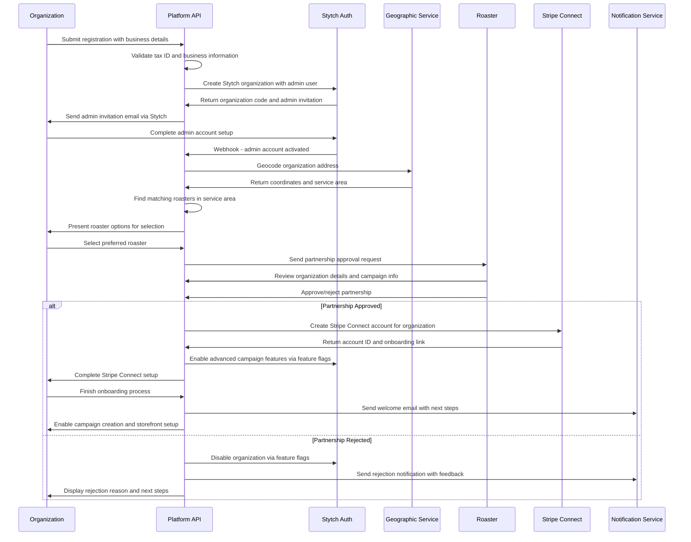
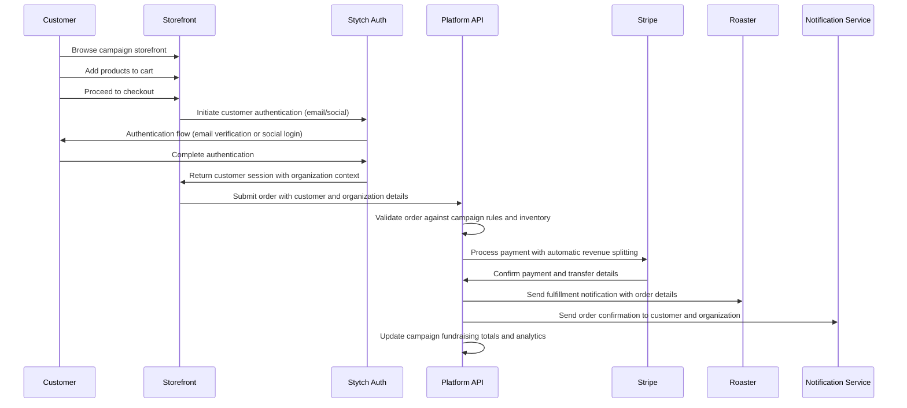

# Core Workflows

## Organization Onboarding and Approval Workflow

```mermaid
sequenceDiagram
    participant O as Organization
    participant P as Platform API
    participant K as Stytch Auth
    participant G as Geographic Service
    participant R as Roaster
    participant S as Stripe Connect
    participant N as Notification Service

    O->>P: Submit registration with business details
    P->>P: Validate tax ID and business information
    P->>K: Create Stytch organization with admin user
    K->>P: Return organization code and admin invitation
    P->>O: Send admin invitation email via Stytch
    O->>K: Complete admin account setup
    K->>P: Webhook - admin account activated
    P->>G: Geocode organization address
    G->>P: Return coordinates and service area
    P->>P: Find matching roasters in service area
    P->>O: Present roaster options for selection
    O->>P: Select preferred roaster
    P->>R: Send partnership approval request
    R->>P: Review organization details and campaign info
    R->>P: Approve/reject partnership
    alt Partnership Approved
        P->>S: Create Stripe Connect account for organization
        S->>P: Return account ID and onboarding link
        P->>K: Enable advanced campaign features via feature flags
        P->>O: Complete Stripe Connect setup
        O->>P: Finish onboarding process
        P->>N: Send welcome email with next steps
        P->>O: Enable campaign creation and storefront setup
    else Partnership Rejected
        P->>K: Disable organization via feature flags
        P->>N: Send rejection notification with feedback
        P->>O: Display rejection reason and next steps
    end
```

## Customer Purchase and Authentication Workflow

```mermaid
sequenceDiagram
    participant C as Customer
    participant S as Storefront
    participant K as Stytch Auth
    participant P as Platform API
    participant Pay as Stripe
    participant R as Roaster
    participant N as Notification Service

    C->>S: Browse campaign storefront
    C->>S: Add products to cart
    C->>S: Proceed to checkout
    S->>K: Initiate customer authentication (email/social)
    K->>C: Authentication flow (email verification or social login)
    C->>K: Complete authentication
    K->>S: Return customer session with organization context
    S->>P: Submit order with customer and organization details
    P->>P: Validate order against campaign rules and inventory
    P->>Pay: Process payment with automatic revenue splitting
    Pay->>P: Confirm payment and transfer details
    P->>R: Send fulfillment notification with order details
    P->>N: Send order confirmation to customer and organization
    P->>P: Update campaign fundraising totals and analytics
```
