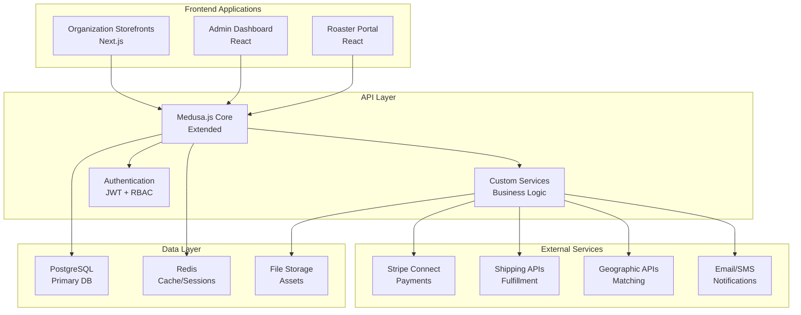

# High Level Architecture

## Technical Summary
The system employs a microservices-oriented architecture built on Medusa.js with custom multi-tenant extensions. The platform uses a hub-and-spoke model where organizations create branded storefronts, roasters manage fulfillment, and the platform orchestrates payments through Stripe Connect. Key architectural patterns include multi-tenant data isolation, event-driven workflows for approvals and fulfillment, and automated revenue splitting with comprehensive audit trails.

## High Level Overview
The platform consists of three main application layers:
1. **Organization Storefronts**: Dynamic Next.js applications with custom branding
2. **Admin Dashboards**: React-based management interfaces for all user types
3. **API Layer**: Extended Medusa.js backend with custom business logic

The system integrates with Stripe Connect for payments, shipping APIs for fulfillment, and geographic services for roaster-organization matching. All data is stored in PostgreSQL with Redis caching for performance.

## Repository Structure
**Structure**: Monorepo with Nx workspace
**Monorepo Tool**: Nx for build optimization and dependency management
**Package Organization**: Apps (storefronts, admin, api) and shared libraries (ui-components, business-logic, types)

## High Level Architecture Diagram

