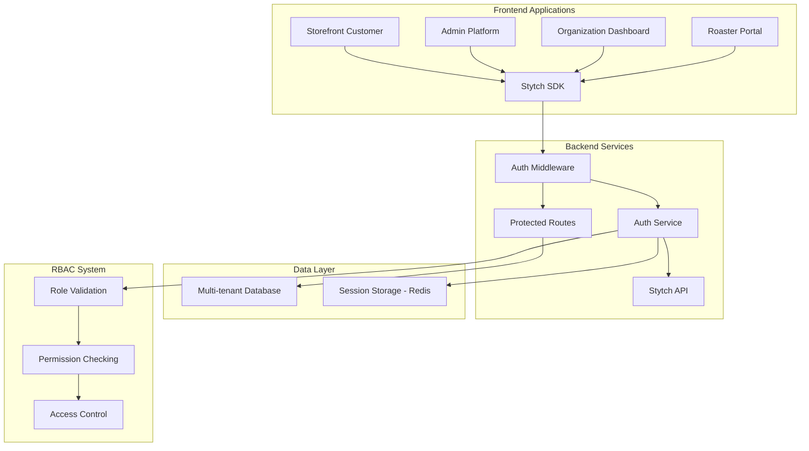

# Stytch Authentication & RBAC System Guide

## Overview

The Joe Perks platform implements a comprehensive multi-tenant authentication and authorization system using Stytch as the identity provider. This guide provides detailed information for developers working on authentication and RBAC features.

## Architecture Overview



## Multi-Tenant Authentication Flow

### 1. User Authentication Process

```typescript
// 1. User initiates login
POST /auth/login
{
  "email": "user@organization.com",
  "password": "password",
  "organizationId": "org-123" // Optional for org-specific login
}

// 2. Stytch validates credentials
// 3. Backend creates session with tenant context
// 4. JWT token includes organization/roaster context
{
  "userId": "user-123",
  "email": "user@organization.com",
  "roles": ["organization_admin"],
  "organizationId": "org-123",
  "roasterId": null,
  "sessionId": "session-456"
}
```

### 2. Token Structure & Claims

```typescript
interface StytchUserContext {
  userId: string              // Unique user identifier
  email: string              // User email address
  roles: UserRole[]          // Array of assigned roles
  organizationId?: string    // Organization context (if applicable)
  roasterId?: string        // Roaster context (if applicable)
  sessionId: string         // Session identifier
  issuedAt: number          // Token issue timestamp
  expiresAt: number         // Token expiration timestamp
}
```

## RBAC System Deep Dive

### Role Hierarchy & Permissions

```typescript
// Role hierarchy (highest to lowest privilege)
enum UserRole {
  PLATFORM_ADMIN = 'platform_admin',        // 🔴 Highest - Full system access
  ORGANIZATION_ADMIN = 'organization_admin', // 🟠 Organization management
  ROASTER_ADMIN = 'roaster_admin',          // 🟠 Roaster management  
  CAMPAIGN_MANAGER = 'campaign_manager',     // 🟡 Campaign operations
  ROASTER_STAFF = 'roaster_staff',          // 🟡 Order fulfillment
  ORGANIZATION_VIEWER = 'organization_viewer', // 🟢 Read-only org access
  CUSTOMER = 'customer'                      // 🔵 Lowest - Purchase only
}
```

### Permission Matrix

| Permission | Platform Admin | Org Admin | Campaign Mgr | Org Viewer | Roaster Admin | Roaster Staff | Customer |
|------------|:--------------:|:---------:|:------------:|:----------:|:-------------:|:-------------:|:--------:|
| MANAGE_PLATFORM | ✅ | ❌ | ❌ | ❌ | ❌ | ❌ | ❌ |
| MANAGE_ORGANIZATION | ✅ | ✅ | ❌ | ❌ | ❌ | ❌ | ❌ |
| CREATE_CAMPAIGNS | ✅ | ✅ | ✅ | ❌ | ❌ | ❌ | ❌ |
| VIEW_ORG_ANALYTICS | ✅ | ✅ | ✅ | ✅ | ❌ | ❌ | ❌ |
| MANAGE_ROASTER | ✅ | ❌ | ❌ | ❌ | ✅ | ❌ | ❌ |
| FULFILL_ORDERS | ✅ | ❌ | ❌ | ❌ | ✅ | ✅ | ❌ |
| PLACE_ORDERS | ✅ | ✅ | ✅ | ✅ | ✅ | ✅ | ✅ |

### Multi-Tenant Access Control

```typescript
// Organization-level isolation
function canAccessOrganization(user: StytchUserContext, orgId: string): boolean {
  // Platform admins can access any organization
  if (hasRole(user, UserRole.PLATFORM_ADMIN)) {
    return true
  }
  
  // Users can only access their own organization
  return user.organizationId === orgId
}

// Roaster-level isolation  
function canAccessRoaster(user: StytchUserContext, roasterId: string): boolean {
  // Platform admins can access any roaster
  if (hasRole(user, UserRole.PLATFORM_ADMIN)) {
    return true
  }
  
  // Users can only access their own roaster
  return user.roasterId === roasterId
}
```

## Implementation Details

### Backend Authentication Service

**Location**: `apps/medusa-server/src/services/auth.service.ts`

```typescript
export class StytchAuthService {
  private client: StytchClient
  
  // Core authentication methods
  async validateToken(token: string): Promise<TokenValidationResult>
  async createSession(email: string, password: string): Promise<TokenValidationResult>
  async revokeSession(sessionToken: string): Promise<boolean>
  
  // RBAC helper methods
  hasRole(user: StytchUserContext, role: UserRole): boolean
  hasPermission(user: StytchUserContext, permission: Permission): boolean
  canAccessOrganization(user: StytchUserContext, orgId: string): boolean
  canAccessRoaster(user: StytchUserContext, roasterId: string): boolean
}
```

### Express Middleware Integration

**Location**: `apps/medusa-server/src/middleware/auth.middleware.ts`

```typescript
// Usage examples for route protection
app.get('/admin/users', requirePlatformAdmin, getUsersHandler)
app.get('/org/:orgId/campaigns', requireOrganizationAdmin, getCampaignsHandler)
app.post('/roaster/:roasterId/orders', requireRoasterStaff, fulfillOrderHandler)

// Middleware options
interface AuthMiddlewareOptions {
  required?: boolean           // Is authentication required?
  roles?: UserRole[]          // Required roles
  permissions?: Permission[]   // Required permissions
  organizationAccess?: boolean // Check organization access
  roasterAccess?: boolean     // Check roaster access
}
```

### API Route Examples

**Location**: `apps/medusa-server/src/api/auth/`

```typescript
// Login endpoint
POST /auth/login
{
  "email": "admin@organization.com",
  "password": "secure_password",
  "organizationId": "org-123"  // Optional
}

// Response includes user context and permissions
{
  "sessionToken": "jwt_token_here",
  "user": {
    "userId": "user-123",
    "email": "admin@organization.com", 
    "roles": ["organization_admin"],
    "organizationId": "org-123"
  },
  "permissions": ["MANAGE_ORGANIZATION", "CREATE_CAMPAIGNS", ...]
}
```

## Frontend Integration Patterns

### React Hook Pattern (Recommended)

```typescript
// Custom hook for authentication
function useAuth() {
  const [session, setSession] = useState<AuthSession | null>(null)
  
  const login = async (email: string, password: string) => {
    const response = await fetch('/auth/login', {
      method: 'POST',
      body: JSON.stringify({ email, password })
    })
    const data = await response.json()
    setSession(createAuthSession(data.user))
  }
  
  return { session, login, logout, hasRole, hasPermission }
}

// Component usage
function AdminPanel() {
  const { session, hasRole } = useAuth()
  
  if (!hasRole(UserRole.PLATFORM_ADMIN)) {
    return <AccessDenied />
  }
  
  return <AdminDashboard />
}
```

### Route Protection Pattern

```typescript
// Higher-order component for route protection
function withAuth(Component: React.FC, requiredRole: UserRole) {
  return function AuthenticatedComponent(props: any) {
    const { session } = useAuth()
    
    if (!session?.isAuthenticated) {
      return <LoginPage />
    }
    
    if (!hasRole(session.user, requiredRole)) {
      return <AccessDenied />
    }
    
    return <Component {...props} />
  }
}

// Usage
const AdminDashboard = withAuth(DashboardComponent, UserRole.PLATFORM_ADMIN)
```

## Database Integration

### User-Organization Relationships

```sql
-- Users table with tenant context
CREATE TABLE users (
  id UUID PRIMARY KEY,
  email VARCHAR UNIQUE NOT NULL,
  stytch_user_id VARCHAR UNIQUE NOT NULL,
  organization_id UUID REFERENCES organizations(id),
  roaster_id UUID REFERENCES roasters(id),
  roles TEXT[] NOT NULL DEFAULT '{"customer"}',
  created_at TIMESTAMP DEFAULT NOW()
);

-- Organization isolation at database level
CREATE POLICY organization_isolation ON campaigns
  FOR ALL TO authenticated_users
  USING (organization_id = current_setting('app.current_organization_id')::UUID);
```

### Session Storage (Redis)

```typescript
// Session data structure in Redis
interface RedisSession {
  userId: string
  organizationId?: string
  roasterId?: string
  roles: UserRole[]
  permissions: Permission[]
  expiresAt: number
}

// Key pattern: "session:{sessionId}"
// TTL: 24 hours (configurable)
```

## Testing Strategies

### Unit Testing Authentication

```typescript
describe('StytchAuthService', () => {
  it('should validate organization access correctly', () => {
    const user = createMockUser({
      roles: [UserRole.ORGANIZATION_ADMIN],
      organizationId: 'org-123'
    })
    
    expect(authService.canAccessOrganization(user, 'org-123')).toBe(true)
    expect(authService.canAccessOrganization(user, 'org-456')).toBe(false)
  })
  
  it('should allow platform admin to access any organization', () => {
    const admin = createMockUser({
      roles: [UserRole.PLATFORM_ADMIN]
    })
    
    expect(authService.canAccessOrganization(admin, 'any-org')).toBe(true)
  })
})
```

### Integration Testing

```typescript
describe('Auth Middleware Integration', () => {
  it('should protect organization routes', async () => {
    const response = await request(app)
      .get('/org/123/campaigns')
      .set('Authorization', 'Bearer invalid_token')
      .expect(401)
      
    expect(response.body.error).toBe('Invalid token')
  })
  
  it('should allow access with valid organization context', async () => {
    const token = createValidToken({
      organizationId: '123',
      roles: [UserRole.ORGANIZATION_ADMIN]
    })
    
    await request(app)
      .get('/org/123/campaigns')
      .set('Authorization', `Bearer ${token}`)
      .expect(200)
  })
})
```

## Security Considerations

### Token Security
- **JWT Validation**: All tokens validated against Stytch API
- **Session Cookies**: HTTP-only, secure, SameSite=strict
- **Token Expiration**: 24-hour default with refresh capability
- **CORS Configuration**: Strict origin validation

### Multi-Tenant Security
- **Data Isolation**: Organization/roaster-level access control
- **SQL Injection Prevention**: Parameterized queries only
- **Authorization Bypass Prevention**: Middleware on all protected routes
- **Audit Logging**: All authentication events logged

### Production Hardening
- **Rate Limiting**: Login attempt throttling
- **Session Management**: Secure session storage in Redis
- **Error Handling**: No sensitive data in error responses
- **HTTPS Only**: All authentication over encrypted connections

## Troubleshooting Guide

### Common Issues

1. **"Cannot find module 'shared-types'"**
   ```bash
   # Build shared libraries first
   pnpm nx build shared-types shared-utils
   ```

2. **"Invalid token" errors**
   ```bash
   # Check Stytch configuration
   pnpm nx auth:test medusa-server
   ```

3. **Permission denied for valid users**
   ```typescript
   // Check role assignment in Stytch dashboard
   // Verify ROLE_PERMISSIONS mapping
   ```

### Debug Commands

```bash
# Test authentication setup
pnpm nx auth:test medusa-server

# Check Redis connection
pnpm nx redis:test medusa-server

# Validate database connection
pnpm nx db:check medusa-server

# View server logs
pnpm nx serve medusa-server --verbose
```

## Future Enhancements

### Planned Features
- **OAuth Providers**: Google, GitHub, Microsoft integration
- **MFA Support**: Two-factor authentication
- **User Management UI**: Admin interface for user management
- **Audit Logging**: Comprehensive authentication audit trail
- **Role Templates**: Predefined role configurations
- **API Key Authentication**: Service-to-service authentication

### Scalability Considerations
- **Session Clustering**: Redis cluster for high availability
- **Token Caching**: Cache validated tokens to reduce Stytch API calls
- **Database Sharding**: Organization-based database partitioning
- **CDN Integration**: Static asset authentication

---

This guide provides the foundation for understanding and extending the Joe Perks authentication and RBAC system. For specific implementation questions, refer to the code examples and test cases in the respective directories.
