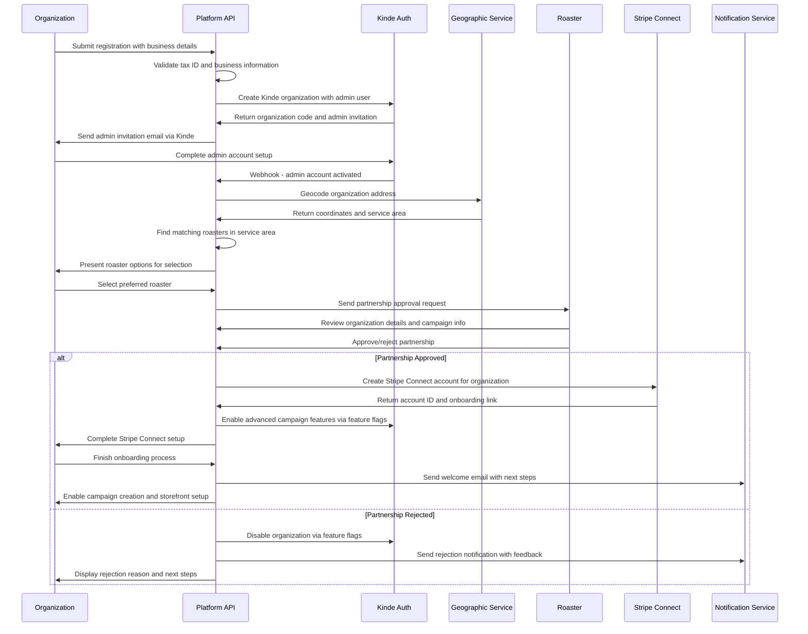

# Story 2.2: Organization Onboarding Workflow Implementation

## Status
Draft

## Story
**As a** platform developer,
**I want** to implement the complete organization onboarding workflow with Kinde integration,
**so that** new fundraising organizations can register, get matched with roasters, and complete setup through an automated approval process.

## Acceptance Criteria
1. Organization registration workflow captures all required business information
2. Kinde organization and admin user creation is automated during registration
3. Geographic address validation and roaster matching is functional
4. Partnership approval workflow with roasters is implemented
5. Stripe Connect account setup integration is working
6. Feature flag activation based on approval status is functional
7. Email notifications are sent at each workflow stage
8. Onboarding status tracking and progress indicators are available

## Tasks / Subtasks
- [ ] Implement registration workflow (AC: 1)
  - [ ] Create organization registration form validation
  - [ ] Implement business information capture and validation
  - [ ] Add tax ID verification and encryption
  - [ ] Create registration data sanitization and storage
- [ ] Integrate Kinde organization creation (AC: 2)
  - [ ] Implement automatic Kinde organization setup
  - [ ] Create admin user invitation workflow
  - [ ] Add organization code generation and mapping
  - [ ] Implement webhook handling for account activation
- [ ] Create geographic matching system (AC: 3)
  - [ ] Implement address geocoding with Google Maps API
  - [ ] Create roaster service area matching algorithm
  - [ ] Add distance calculation and ranking logic
  - [ ] Implement fallback options for unserviced areas
- [ ] Implement partnership approval workflow (AC: 4)
  - [ ] Create partnership request generation and routing
  - [ ] Implement roaster approval/rejection interface
  - [ ] Add approval criteria validation and auto-approval
  - [ ] Create partnership status tracking and history
- [ ] Integrate Stripe Connect setup (AC: 5)
  - [ ] Implement Stripe Connect account creation
  - [ ] Create onboarding link generation and handling
  - [ ] Add account verification status tracking
  - [ ] Implement webhook handling for account updates
- [ ] Create feature flag management (AC: 6)
  - [ ] Implement approval-based feature activation
  - [ ] Add feature flag synchronization with Kinde
  - [ ] Create feature access validation middleware
  - [ ] Implement feature rollback for rejected organizations
- [ ] Implement notification system (AC: 7)
  - [ ] Create email templates for each workflow stage
  - [ ] Implement notification trigger system
  - [ ] Add notification preference management
  - [ ] Create notification delivery tracking
- [ ] Create progress tracking system (AC: 8)
  - [ ] Implement onboarding status state machine
  - [ ] Create progress indicator API endpoints
  - [ ] Add status change audit logging
  - [ ] Implement completion percentage calculation
- [ ] Implement comprehensive testing (AC: All)
  - [ ] Unit tests for workflow state transitions
  - [ ] Integration tests for complete onboarding flow
  - [ ] Mock external service testing (Kinde, Stripe, Maps)
  - [ ] Error handling and rollback scenario testing

## Dev Notes

### Previous Story Insights
**From Story 1.1**: Authentication service handles Kinde OAuth and organization context.  
**From Story 1.3**: User management service handles organization membership and invitations.  
**From Story 2.1**: Organization management service provides CRUD operations and multi-tenant isolation.

### Workflow Specifications
**Organization Onboarding Workflow** [Source: architecture/core-workflows.md#organization-onboarding]:

### Data Models Integration
**Organization Status States**:
- `pending` - Initial registration, awaiting admin setup
- `admin_setup` - Kinde admin account created, awaiting activation
- `address_validation` - Admin activated, validating address and finding roasters
- `roaster_selection` - Presenting roaster options to organization
- `partnership_pending` - Awaiting roaster approval decision
- `stripe_setup` - Partnership approved, setting up payment processing
- `active` - Fully onboarded and operational
- `rejected` - Partnership rejected or setup failed
- `suspended` - Temporarily disabled

### API Integration Points
**Geographic Matching Service** [Source: architecture/components.md#geographic-matching-service]:
- **Primary Responsibility**: Location-based roaster-organization matching and service area validation
- **Key Interfaces**: `/geographic/match`, `/geographic/validate`, `/geographic/distance`
- **Dependencies**: Google Maps API for geocoding, roaster service for service areas
- **Technology**: PostGIS for geographic queries, Google Maps API integration

### File Locations
**Workflow Services** [Source: architecture/source-tree.md#services]:
- `apps/api/src/services/onboarding.service.ts` - Main onboarding workflow orchestration
- `apps/api/src/services/geographic.service.ts` - Address validation and roaster matching
- `apps/api/src/services/partnership.service.ts` - Partnership approval workflow

**API Routes**:
- `apps/api/src/api/onboarding/` - Onboarding workflow endpoints
- `apps/api/src/api/onboarding/register/` - Registration endpoints
- `apps/api/src/api/onboarding/status/` - Status tracking endpoints

**Workflow State Management**:
- `apps/api/src/workflows/onboarding-state-machine.ts` - State transition logic
- `apps/api/src/workflows/approval-workflow.ts` - Partnership approval logic

### Technical Constraints
**External Service Integration** [Source: architecture/tech-stack.md#external-integrations]:
- **Kinde**: Multi-tenant auth, RBAC, and feature flags
- **Stripe Connect**: Multi-party payment processing setup
- **Google Maps API**: Geocoding and distance calculations
- **SendGrid**: Transactional email notifications

**Geographic Matching Requirements**:
- PostGIS for geographic queries and distance calculations
- Service radius validation for roaster coverage areas
- Fallback logic for organizations outside service areas
- Performance optimization for location-based queries

### Security Considerations
**Data Protection** [Source: architecture/security-considerations.md#data-protection]:
- Tax ID encryption during registration process
- Secure handling of business information during validation
- Multi-tenant data isolation throughout workflow
- Audit trail for all onboarding decisions and status changes

**Feature Flag Security** [Source: architecture/security-considerations.md#feature-flag-management]:
- Organization-level feature flag targeting
- Automatic feature activation/deactivation based on approval status
- Feature flag synchronization between platform and Kinde
- Rollback capabilities for rejected organizations

### Integration Dependencies
**Foundation Services**:
- **Authentication Service (1.1)**: Kinde integration and JWT handling
- **User Management (1.3)**: Admin user creation and invitation
- **Organization Management (2.1)**: Organization CRUD and status management

**External Services**:
- **Geographic Service**: Address validation and roaster matching
- **Notification Service**: Email notifications at workflow stages
- **Payment Service**: Stripe Connect account setup

### Testing
**Testing Standards** [Source: architecture/testing-strategy.md#end-to-end-testing]:
- **User Workflows**: Complete onboarding journey testing
- **Multi-tenant Isolation**: Verify data separation during onboarding
- **External Service Mocking**: Mock Kinde, Stripe, and Google Maps APIs
- **Error Scenarios**: Test failure handling and rollback procedures

**Test File Locations**:
- Workflow tests: `apps/api/src/workflows/__tests__/onboarding.test.ts`
- Integration tests: `apps/api/src/api/onboarding/__tests__/`
- End-to-end tests: `apps/api/src/__tests__/onboarding-e2e.test.ts`

## Change Log
| Date | Version | Description | Author |
|------|---------|-------------|---------|
| 2024-01-XX | 1.0 | Initial story creation | Sarah (PO) |

## Dev Agent Record
*This section will be populated by the development agent during implementation*

### Agent Model Used
*To be filled by dev agent*

### Debug Log References
*To be filled by dev agent*

### Completion Notes List
*To be filled by dev agent*

### File List
*To be filled by dev agent*

## QA Results
*Results from QA Agent review will be populated here*
