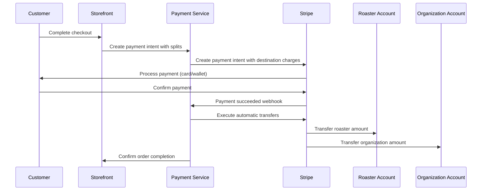

# Story 5.1: Stripe Connect Integration Implementation

## Status
Draft

## Story
**As a** platform developer,
**I want** to implement Stripe Connect integration for multi-party payment processing,
**so that** organizations and roasters can receive payments with automatic revenue splitting and platform fee collection.

## Acceptance Criteria
1. Stripe Connect account creation and onboarding for organizations is functional
2. Roaster Stripe Connect account setup and verification is implemented
3. Multi-party payment processing with automatic splits is working
4. Platform fee collection and management is functional
5. Payment method handling (cards, digital wallets) is comprehensive
6. Webhook integration for payment status updates is implemented
7. Payout management and scheduling for connected accounts is available
8. Compliance and regulatory requirements (KYC, tax reporting) are met

## Tasks / Subtasks
- [ ] Implement Stripe Connect account creation (AC: 1, 2)
  - [ ] Create Stripe Connect Express account setup for organizations
  - [ ] Implement roaster Stripe Connect account creation
  - [ ] Add account verification and KYC compliance workflows
  - [ ] Create account status tracking and management
- [ ] Create multi-party payment processing (AC: 3)
  - [ ] Implement payment intent creation with destination charges
  - [ ] Add automatic payment splitting logic
  - [ ] Create payment confirmation and settlement workflows
  - [ ] Implement payment failure handling and retry logic
- [ ] Implement platform fee management (AC: 4)
  - [ ] Create configurable platform fee structure
  - [ ] Add fee calculation and collection logic
  - [ ] Implement fee reporting and analytics
  - [ ] Create fee adjustment and refund capabilities
- [ ] Create payment method handling (AC: 5)
  - [ ] Implement credit/debit card processing
  - [ ] Add digital wallet support (Apple Pay, Google Pay)
  - [ ] Create payment method validation and security
  - [ ] Implement saved payment methods for customers
- [ ] Integrate webhook system (AC: 6)
  - [ ] Create Stripe webhook endpoint and validation
  - [ ] Implement payment status update handlers
  - [ ] Add account status change notifications
  - [ ] Create webhook retry and error handling
- [ ] Implement payout management (AC: 7)
  - [ ] Create payout scheduling and automation
  - [ ] Add payout status tracking and notifications
  - [ ] Implement manual payout controls for platform admin
  - [ ] Create payout reporting and reconciliation
- [ ] Ensure compliance requirements (AC: 8)
  - [ ] Implement KYC verification workflows
  - [ ] Add tax reporting and 1099 generation
  - [ ] Create compliance monitoring and alerts
  - [ ] Implement data retention and privacy controls
- [ ] Implement comprehensive testing (AC: All)
  - [ ] Unit tests for payment processing logic
  - [ ] Integration tests with Stripe APIs
  - [ ] Webhook handling and validation testing
  - [ ] End-to-end payment flow testing

## Dev Notes

### Previous Story Insights
**From Story 2.2**: Organization onboarding workflow includes Stripe Connect account setup.  
**From Story 3.1**: Roaster management requires Stripe Connect integration for payment processing.  
**From Story 4.1**: Campaign management needs payment processing for order completion.

### Stripe Connect Architecture
**Connect Account Types**:
- **Organizations**: Stripe Connect Express accounts for simplified onboarding
- **Roasters**: Stripe Connect Standard accounts for full control and branding
- **Platform**: Main Stripe account for fee collection and oversight

**Payment Flow Architecture**:
```
Customer Payment → Platform Account → Automatic Splits:
├── Roaster Account (Wholesale + Shipping)
├── Organization Account (Fundraising Amount)
└── Platform Account (Platform Fee)
```

### Data Models Integration
**Stripe Connect Integration Schema**:
```sql
-- Stripe Connect account tracking
CREATE TABLE stripe_connect_accounts (
    id UUID PRIMARY KEY DEFAULT gen_random_uuid(),
    entity_id UUID NOT NULL, -- organization_id or roaster_id
    entity_type VARCHAR(50) NOT NULL CHECK (entity_type IN ('organization', 'roaster')),
    stripe_account_id VARCHAR(255) UNIQUE NOT NULL,
    account_type VARCHAR(50) NOT NULL, -- express, standard
    onboarding_status VARCHAR(50) DEFAULT 'pending',
    verification_status VARCHAR(50) DEFAULT 'unverified',
    capabilities JSONB DEFAULT '{}',
    requirements JSONB DEFAULT '{}',
    payouts_enabled BOOLEAN DEFAULT false,
    charges_enabled BOOLEAN DEFAULT false,
    created_at TIMESTAMP DEFAULT CURRENT_TIMESTAMP,
    updated_at TIMESTAMP DEFAULT CURRENT_TIMESTAMP
);

-- Payment processing records
CREATE TABLE payments (
    id UUID PRIMARY KEY DEFAULT gen_random_uuid(),
    order_id UUID REFERENCES orders(id),
    stripe_payment_intent_id VARCHAR(255) UNIQUE NOT NULL,
    amount_total DECIMAL(10,2) NOT NULL,
    amount_roaster DECIMAL(10,2) NOT NULL,
    amount_organization DECIMAL(10,2) NOT NULL,
    amount_platform_fee DECIMAL(10,2) NOT NULL,
    currency VARCHAR(3) DEFAULT 'USD',
    status VARCHAR(50) DEFAULT 'pending',
    payment_method_type VARCHAR(50),
    failure_reason TEXT,
    processed_at TIMESTAMP,
    created_at TIMESTAMP DEFAULT CURRENT_TIMESTAMP
);
```

### Component Specifications
**Payment Processing Service** [Source: architecture/components.md#payment-processing-service]:
- **Primary Responsibility**: Multi-party payment processing, revenue splitting, and fee collection
- **Key Interfaces**: Payment intent creation, Connect account management, webhook processing
- **Dependencies**: Stripe Connect API, order service, organization/roaster services
- **Technology**: Stripe Connect with destination charges and automatic payouts

### API Integration Points
**Payment Processing Endpoints**:
- `POST /payments/create-intent` - Create payment intent with splits
- `POST /payments/confirm` - Confirm payment and execute transfers
- `GET /payments/{payment_id}/status` - Check payment status and details
- `POST /stripe/webhooks` - Handle Stripe webhook events
- `GET /connect-accounts/{connect_account_id}/status` - Check Connect account status

**Stripe Connect Endpoints**:
- `POST /connect/accounts/create` - Create Connect account for entity
- `GET /connect/accounts/{connect_account_id}/onboarding-link` - Generate onboarding URL
- `PUT /connect/accounts/{connect_account_id}/update` - Update account information
- `GET /connect/accounts/{connect_account_id}/balance` - Check account balance and payouts

### File Locations
**Payment Services** [Source: architecture/source-tree.md#services]:
- `apps/medusa-server/src/services/payment.service.ts` - Core payment processing
- `apps/medusa-server/src/services/stripe-connect.service.ts` - Connect account management
- `apps/medusa-server/src/services/revenue-split.service.ts` - Revenue splitting logic
- `apps/medusa-server/src/services/webhook.service.ts` - Stripe webhook handling

**API Routes**:
- `apps/medusa-server/src/api/payments/` - Payment processing endpoints
- `apps/medusa-server/src/api/stripe/` - Stripe-specific endpoints and webhooks
- `apps/medusa-server/src/api/connect/` - Connect account management endpoints

**Shared Libraries** [Source: architecture/source-tree.md#libs]:
- `libs/business-logic/src/payments/` - Payment calculation utilities
- `libs/shared-types/src/payments/` - Payment and Connect type definitions

### Technical Constraints
**Stripe Connect Requirements** [Source: architecture/tech-stack.md#external-integrations]:
- **Payments**: Stripe Connect for multi-party transactions
- **Account Types**: Express for organizations, Standard for roasters
- **Compliance**: KYC verification, tax reporting, data retention
- **Security**: PCI compliance, secure webhook validation

**Revenue Splitting Logic**:
```typescript
interface RevenueSplit {
  totalAmount: number;
  roasterAmount: number;      // Wholesale price + shipping
  organizationAmount: number; // Fundraising markup
  platformFee: number;        // Platform commission
  stripeFee: number;          // Stripe processing fee
}

const calculateRevenueSplit = (orderTotal: number, wholesalePrice: number, platformFeeRate: number): RevenueSplit => {
  const stripeFee = (orderTotal * 0.029) + 0.30; // Stripe standard rates
  const platformFee = orderTotal * platformFeeRate;
  const organizationAmount = orderTotal - wholesalePrice - platformFee - stripeFee;
  
  return {
    totalAmount: orderTotal,
    roasterAmount: wholesalePrice,
    organizationAmount,
    platformFee,
    stripeFee
  };
};
```

### Integration Dependencies
**Foundation Services Integration**:
- **Organization Management (2.1)**: Connect account creation during onboarding
- **Roaster Management (3.1)**: Roaster Connect account setup and verification
- **Campaign Management (4.1)**: Payment processing for campaign orders

**Order Processing Integration**:
- **Order Service**: Payment confirmation and order status updates
- **Inventory Service**: Stock allocation and reservation during payment
- **Notification Service**: Payment confirmation and failure notifications

### Stripe Connect Onboarding Flow
**Organization Onboarding** [Source: architecture/core-workflows.md#organization-onboarding]:
1. Create Stripe Connect Express account
2. Generate onboarding link for organization
3. Organization completes Stripe onboarding
4. Webhook confirms account activation
5. Enable payment processing for organization campaigns

**Account Verification Requirements**:
- Business information and tax ID verification
- Bank account details for payouts
- Identity verification for account holders
- Compliance with Stripe's terms of service

### Payment Processing Workflow
**Customer Payment Flow**:


### Webhook Integration
**Critical Stripe Webhooks**:
- `payment_intent.succeeded` - Payment confirmation and order completion
- `payment_intent.payment_failed` - Payment failure handling
- `account.updated` - Connect account status changes
- `payout.paid` - Payout confirmation for connected accounts
- `invoice.payment_succeeded` - Platform fee collection confirmation

**Webhook Security**:
- Stripe signature verification for all webhooks
- Idempotency handling for duplicate events
- Error handling and retry logic for failed processing
- Audit logging for all webhook events

### Compliance and Security
**KYC and Verification**:
- Automated identity verification through Stripe
- Business verification for organization accounts
- Tax ID validation and reporting requirements
- Ongoing compliance monitoring and alerts

**Data Security** [Source: architecture/security-considerations.md#financial-security]:
- PCI DSS compliance for payment data handling
- Secure storage of Connect account information
- Encryption of sensitive financial data
- Audit trails for all payment transactions

### Fee Structure and Management
**Platform Fee Configuration**:
```typescript
interface PlatformFeeStructure {
  baseRate: number;           // Base platform fee percentage
  volumeDiscounts: {          // Volume-based fee reductions
    threshold: number;
    discountRate: number;
  }[];
  campaignTypeRates: {        // Different rates by campaign type
    standard: number;
    premium: number;
    enterprise: number;
  };
}
```

**Fee Collection and Reporting**:
- Automatic fee collection on each transaction
- Monthly fee reporting and reconciliation
- Fee adjustment capabilities for special cases
- Tax reporting for platform revenue

### Testing
**Testing Standards** [Source: architecture/testing-strategy.md#external-services]:
- **Payment Processing**: Mock Stripe APIs for consistent testing
- **Webhook Testing**: Simulate Stripe webhook events
- **Integration Testing**: End-to-end payment flow validation
- **Security Testing**: Webhook signature validation and PCI compliance

**Test File Locations**:
- Service tests: `apps/medusa-server/src/services/__tests__/payment.service.test.ts`
- Webhook tests: `apps/medusa-server/src/api/stripe/__tests__/webhooks.test.ts`
- Integration tests: `apps/medusa-server/src/__tests__/payment-flow-e2e.test.ts`
- Security tests: `apps/medusa-server/src/__tests__/payment-security.test.ts`

## Change Log
| Date | Version | Description | Author |
|------|---------|-------------|---------|
| 2024-01-XX | 1.0 | Initial story creation | Sarah (PO) |

## Dev Agent Record
*This section will be populated by the development agent during implementation*

### Agent Model Used
*To be filled by dev agent*

### Debug Log References
*To be filled by dev agent*

### Completion Notes List
*To be filled by dev agent*

### File List
*To be filled by dev agent*

## QA Results
*Results from QA Agent review will be populated here*
