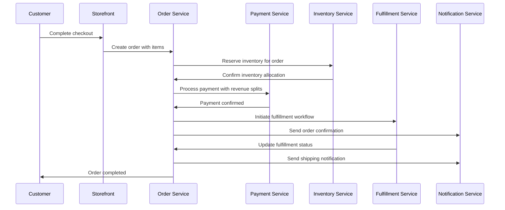

# Story 5.2: Multi-Party Payment Processing Implementation

## Status
Draft

## Story
**As a** platform developer,
**I want** to implement comprehensive multi-party payment processing with order management,
**so that** customers can complete purchases with automatic revenue distribution, inventory management, and order fulfillment initiation.

## Acceptance Criteria
1. Complete checkout flow with payment processing is functional
2. Order creation and inventory allocation works correctly
3. Automatic revenue splitting and distribution is implemented
4. Payment failure handling and retry mechanisms are functional
5. Refund and cancellation processing is available
6. Order status tracking and customer notifications are implemented
7. Tax calculation and compliance reporting is functional
8. Integration with fulfillment systems is working

## Tasks / Subtasks
- [ ] Implement checkout flow (AC: 1)
  - [ ] Create multi-step checkout process
  - [ ] Add payment method selection and validation
  - [ ] Implement customer information capture
  - [ ] Create order summary and confirmation
- [ ] Create order management system (AC: 2)
  - [ ] Implement order creation with inventory allocation
  - [ ] Add order validation and business rule enforcement
  - [ ] Create order status management and tracking
  - [ ] Implement order modification and cancellation
- [ ] Implement revenue splitting (AC: 3)
  - [ ] Create automatic payment distribution logic
  - [ ] Add revenue split calculation and validation
  - [ ] Implement split payment execution
  - [ ] Create revenue reconciliation and reporting
- [ ] Create payment failure handling (AC: 4)
  - [ ] Implement payment retry mechanisms
  - [ ] Add failure notification and recovery workflows
  - [ ] Create payment method fallback options
  - [ ] Implement abandoned cart recovery
- [ ] Implement refund processing (AC: 5)
  - [ ] Create refund request and approval workflows
  - [ ] Add partial and full refund capabilities
  - [ ] Implement refund distribution across parties
  - [ ] Create refund tracking and reporting
- [ ] Create order tracking system (AC: 6)
  - [ ] Implement order status updates and notifications
  - [ ] Add customer order history and tracking
  - [ ] Create order communication and updates
  - [ ] Implement delivery confirmation and feedback
- [ ] Implement tax processing (AC: 7)
  - [ ] Create tax calculation based on location
  - [ ] Add tax collection and remittance
  - [ ] Implement tax reporting and compliance
  - [ ] Create tax exemption handling
- [ ] Integrate fulfillment systems (AC: 8)
  - [ ] Create fulfillment workflow initiation
  - [ ] Add shipping calculation and selection
  - [ ] Implement fulfillment status tracking
  - [ ] Create delivery notification system
- [ ] Implement comprehensive testing (AC: All)
  - [ ] Unit tests for payment processing logic
  - [ ] Integration tests for complete order flow
  - [ ] Payment failure and recovery testing
  - [ ] Tax calculation and compliance testing

## Dev Notes

### Previous Story Insights
**From Story 5.1**: Stripe Connect integration provides multi-party payment infrastructure and revenue splitting capabilities.  
**From Story 4.2**: Dynamic storefront provides customer checkout interface and cart management.  
**From Story 4.1**: Campaign management provides product selection and pricing configuration.

### Order Processing Data Models
**Order Management Schema**:
```sql
-- Complete order tracking
CREATE TABLE orders (
    id UUID PRIMARY KEY DEFAULT gen_random_uuid(),
    campaign_id UUID REFERENCES campaigns(id),
    customer_email VARCHAR(255) NOT NULL,
    customer_data JSONB NOT NULL,
    order_number VARCHAR(50) UNIQUE NOT NULL,
    subtotal DECIMAL(10,2) NOT NULL,
    tax_amount DECIMAL(10,2) DEFAULT 0,
    shipping_amount DECIMAL(10,2) DEFAULT 0,
    total_amount DECIMAL(10,2) NOT NULL,
    payment_id UUID REFERENCES payments(id),
    status VARCHAR(50) DEFAULT 'pending',
    fulfillment_status VARCHAR(50) DEFAULT 'unfulfilled',
    shipping_address JSONB NOT NULL,
    billing_address JSONB,
    notes TEXT,
    created_at TIMESTAMP DEFAULT CURRENT_TIMESTAMP,
    updated_at TIMESTAMP DEFAULT CURRENT_TIMESTAMP
);

-- Order line items
CREATE TABLE order_items (
    id UUID PRIMARY KEY DEFAULT gen_random_uuid(),
    order_id UUID REFERENCES orders(id) ON DELETE CASCADE,
    product_id UUID REFERENCES products(id),
    quantity INTEGER NOT NULL,
    unit_price DECIMAL(8,2) NOT NULL,
    total_price DECIMAL(10,2) NOT NULL,
    product_snapshot JSONB NOT NULL, -- Product details at time of order
    created_at TIMESTAMP DEFAULT CURRENT_TIMESTAMP
);
```

**Order Status States**:
- `pending` - Order created, awaiting payment
- `payment_processing` - Payment in progress
- `paid` - Payment confirmed, ready for fulfillment
- `fulfilled` - Order shipped/delivered
- `cancelled` - Order cancelled before fulfillment
- `refunded` - Order refunded after payment
- `failed` - Payment failed, order invalid

### Payment Processing Workflow
**Complete Order Flow**:


### Revenue Splitting Implementation
**Advanced Revenue Split Logic**:
```typescript
interface OrderRevenueSplit {
  orderId: string;
  totalAmount: number;
  splits: {
    roaster: {
      accountId: string;
      amount: number;
      description: string;
    };
    organization: {
      accountId: string;
      amount: number;
      description: string;
    };
    platform: {
      amount: number;
      description: string;
    };
  };
  taxes: {
    amount: number;
    jurisdiction: string;
  }[];
  fees: {
    stripe: number;
    platform: number;
  };
}
```

**Split Calculation Logic**:
- **Roaster Share**: Wholesale price + shipping costs + roaster markup
- **Organization Share**: Fundraising markup - platform fee
- **Platform Share**: Platform fee percentage of total order
- **Tax Handling**: Collected separately, remitted to appropriate jurisdictions

### API Integration Points
**Order Processing Endpoints**:
- `POST /orders/create` - Create order with inventory reservation
- `POST /orders/{order_id}/process-payment` - Process payment with splits
- `PUT /orders/{order_id}/status` - Update order status
- `GET /orders/{order_id}/tracking` - Get order status and tracking info
- `POST /orders/{order_id}/refund` - Process refund request

**Customer Endpoints**:
- `GET /customers/{customer_email}/orders` - Customer order history
- `GET /orders/{order_id}/receipt` - Order receipt and details
- `POST /orders/{order_id}/cancel` - Customer order cancellation
- `GET /orders/{order_id}/tracking` - Order tracking information

### File Locations
**Order Processing Services** [Source: architecture/source-tree.md#services]:
- `apps/medusa-server/src/services/order.service.ts` - Core order management
- `apps/medusa-server/src/services/checkout.service.ts` - Checkout flow orchestration
- `apps/medusa-server/src/services/inventory.service.ts` - Inventory allocation and tracking
- `apps/medusa-server/src/services/tax.service.ts` - Tax calculation and compliance

**API Routes**:
- `apps/medusa-server/src/api/orders/` - Order management endpoints
- `apps/medusa-server/src/api/checkout/` - Checkout flow endpoints
- `apps/medusa-server/src/api/customers/` - Customer order endpoints

**Database Models**:
- `apps/medusa-server/src/modules/*/models` - Medusa v2 module models (order)
- `apps/medusa-server/src/modules/*/models` - Medusa v2 module models (order item)
- `apps/medusa-server/src/modules/*/models` - Medusa v2 module models (payment split)

### Technical Constraints
**Order Processing Requirements**:
- Atomic transactions for order creation and payment
- Inventory reservation during checkout process
- Automatic inventory release on payment failure
- Order modification restrictions based on status

**Payment Processing Constraints**:
- PCI compliance for payment data handling
- Idempotency for payment processing operations
- Automatic retry logic for failed payments
- Secure handling of customer payment information

### Integration Dependencies
**Payment Integration**:
- **Stripe Connect (5.1)**: Multi-party payment processing and revenue splits
- **Tax Service**: Location-based tax calculation and compliance
- **Inventory Service**: Product availability and allocation

**Business Logic Integration**:
- **Campaign Management (4.1)**: Product pricing and campaign rules
- **Organization Management (2.1)**: Organization-specific settings and branding
- **Customer Authentication (1.1)**: Customer context and order history

### Inventory Management Integration
**Inventory Allocation Logic**:
```typescript
interface InventoryAllocation {
  productId: string;
  quantityRequested: number;
  quantityAllocated: number;
  reservationId: string;
  expiresAt: Date;
}

const reserveInventory = async (orderItems: OrderItem[]): Promise<InventoryAllocation[]> => {
  // Reserve inventory for 15 minutes during checkout
  // Release automatically if payment not completed
  // Update available inventory on successful payment
};
```

**Stock Management**:
- Real-time inventory tracking and updates
- Low stock alerts and notifications
- Backorder handling for out-of-stock items
- Inventory reconciliation and auditing

### Tax Calculation and Compliance
**Tax Service Integration**:
- Location-based tax rate calculation
- Tax jurisdiction determination
- Tax exemption handling for qualified organizations
- Automated tax reporting and remittance

**Tax Calculation Logic**:
```typescript
interface TaxCalculation {
  subtotal: number;
  shippingAddress: Address;
  taxableAmount: number;
  taxRate: number;
  taxAmount: number;
  jurisdiction: string;
  exemptionApplied: boolean;
}
```

### Customer Communication
**Order Notifications**:
- Order confirmation with receipt
- Payment confirmation and processing updates
- Shipping notifications with tracking information
- Delivery confirmation and feedback requests

**Communication Channels** [Source: architecture/tech-stack.md#external-integrations]:
- **Email**: SendGrid for transactional emails
- **SMS**: Twilio for urgent notifications
- **In-App**: Real-time notifications for logged-in customers

### Refund and Cancellation Processing
**Refund Workflow**:
1. Refund request validation and approval
2. Inventory return and reallocation
3. Multi-party refund distribution
4. Customer notification and confirmation
5. Financial reconciliation and reporting

**Refund Distribution Logic**:
- Proportional refund distribution across all parties
- Platform fee handling for refunded orders
- Stripe fee recovery where applicable
- Tax refund processing and reporting

### Error Handling and Recovery
**Payment Failure Scenarios**:
- Insufficient funds or declined cards
- Network timeouts and connectivity issues
- Stripe API errors and rate limiting
- Invalid payment method or expired cards

**Recovery Mechanisms**:
- Automatic payment retry with exponential backoff
- Alternative payment method suggestions
- Cart preservation and recovery emails
- Customer service escalation workflows

### Performance Considerations
**Order Processing Optimization**:
- Database indexing for order queries
- Caching of frequently accessed order data
- Asynchronous processing for non-critical operations
- Background job processing for heavy calculations

**Scalability Requirements**:
- Horizontal scaling for order processing services
- Database partitioning for large order volumes
- CDN integration for order-related assets
- Load balancing for checkout endpoints

### Security Considerations
**Order Data Protection** [Source: architecture/security-considerations.md#financial-security]:
- Encryption of sensitive customer information
- PCI compliance for payment data handling
- Secure order number generation
- Audit logging for all order modifications

**Fraud Prevention**:
- Order validation and risk scoring
- Velocity checking for suspicious activity
- Address verification and validation
- Integration with Stripe Radar for fraud detection

### Testing
**Testing Standards** [Source: architecture/testing-strategy.md#integration-testing]:
- **Order Flow Testing**: Complete checkout to fulfillment workflows
- **Payment Processing**: Mock payment scenarios and edge cases
- **Inventory Integration**: Stock allocation and release testing
- **Multi-party Splits**: Revenue distribution accuracy validation

**Test File Locations**:
- Service tests: `apps/medusa-server/src/services/__tests__/order.service.test.ts`
- Integration tests: `apps/medusa-server/src/api/orders/__tests__/`
- End-to-end tests: `apps/medusa-server/src/__tests__/order-flow-e2e.test.ts`
- Payment tests: `apps/medusa-server/src/__tests__/payment-processing.test.ts`

## Change Log
| Date | Version | Description | Author |
|------|---------|-------------|---------|
| 2024-01-XX | 1.0 | Initial story creation | Sarah (PO) |

## Dev Agent Record
*This section will be populated by the development agent during implementation*

### Agent Model Used
*To be filled by dev agent*

### Debug Log References
*To be filled by dev agent*

### Completion Notes List
*To be filled by dev agent*

### File List
*To be filled by dev agent*

## QA Results
*Results from QA Agent review will be populated here*
